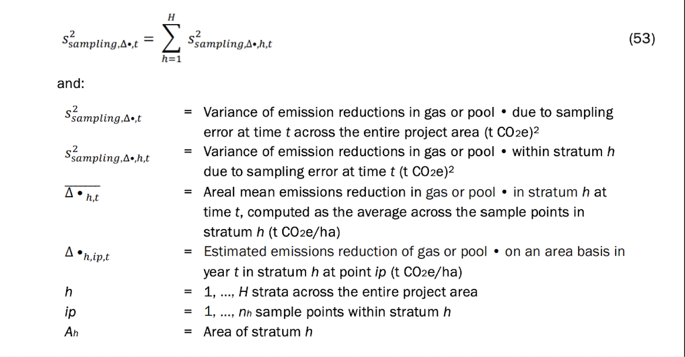

# 1. Introduction

This notebook presents an example of how to calculate the uncertainty deduction for two simulated VM0042 projects utilizing Quantification Approach 1 (Measure and Model). Briefly, QA1 involves the following steps:

1.  Taking physical soil samples at $t0$ to estimate SOC stocks at a series of points in the project area. VM0042 requires that these points are determined using a stratified random sampling design.

2.  Determining historical practices for each management unit (e.g. crop field) in the project. Historical practice information is then used to set a schedule of activities for the baseline scenario.

3.  Initializing a process-based model at t0 based on the soil samples taken in step 1 and modeling the baseline scenario and with-project scenario up to a given time $t$.

4.  Determine the difference in SOC stocks in the project and baseline scenarios to determine project ERRs.

5.  Determine the uncertainty of the estimate of project ERRs by determining the model prediction error and sampling error. Use this estimate of uncertainty to determine and apply an appropriate uncertainty deduction.

In VM0042, the uncertainty deduction is calculated based on an estimate of $s_{\Delta_t}^2$, the variance of the estimate of mean emissions reductions or removals for a given gas or pool within time period $t$. The two key sources of error in VM0042 Quantification Approach 1 are model prediction error and sampling error. Methods to quantify model prediction error and sampling error are detailed in Section 8.6 of VM0042.

This example uses the analytical error propagation method for Quantification Approach 1 (see VM0042 v.2.0 Section 8.6.1.1) as opposed to the Monte Carlo error propagation method. Likewise, this example will deal only with calculating an uncertainty deduction for SOC removals and not any other GHG reductions.

### 1.1. Model prediction error

Model prediction error results from uncertainty in model parameters or model structural errors in the biogeochemical model used to estimate baseline and project SOC stocks and their changes over time. Model prediction error is calculated per the processes outlined in VMD0053 using independent validation datasets from peer-reviewed studies and/or true-up samples from within the project area. Additional details on how model prediction error is determined are provided in VMD0053 and VM0042 v.2.0 Section 8.6.1.1.1.

### 1.2. Sampling error

Sampling error in QA1 results from measuring and subsequently modeling only a portion of the project area via a series of individual points. Sampling error is reduced by increasing the number of points at which modeling is done and/or by developing a more efficient sampling design appropriate to the project. VM0042 v.2.0 requires projects to use a default stratified random sampling design in which strata are developed based on environmental covariates that are predictive of SOC stocks. VM0042 v.2.0 also allows for the use of staged or hierarchical designs to increase sampling efficiency in grouped projects in which several smaller areas or project instances make up the entire project.

The estimator(s) used to determine $s_{\Delta_t}^2$ will vary depending on the sample design and quantification approach used in the project. Project proponents should consult appropriate statistical references to determine how to structure the uncertainty estimator(s) most suited for the sampling design employed in their project.

This example includes calculations based on two possible sampling designs in VM0042 projects. The first is a simplified example of a project with a single large contiguous area split into 5 strata for sampling. This example will match the example uncertainty deduction calculations from Section 8.6 in VM0042 v.2.0. The second is based on a staged sampling design similar to that detailed in Appendix 6 of VM0042 v.2.0.

# 2. Generate hypothetical SOC distributions

Spatial variability of SOC stocks can be high and is a key potential contributor to uncertainty in estimating changes in SOC stocks over time. To accurately simulate the spatial variability of SOC stocks in an agricultural field, this example uses a data set published in [Potash et al. 2023](https://www.sciencedirect.com/science/article/pii/S0016706123002641). In this study the authors densely sampled several fields across Illinois and Nebraska, USA.

```{r import data}
library(tidyverse)
library(truncnorm)

d <- read_csv("https://figshare.com/ndownloader/files/42223749")

```

Next, the data must be processed.

1.  Use the data to calculate stocks at each sample point.
2.  Each field had different sample depth intervals, but all of them went to at least 60 cm. Summarize stock estimates to a 60 cm depth equivalent.

```{r}

# Create new column in dataframe for SOC stocks

d <- 
  d %>%
  mutate(soc_stock_mg_ha = 
           (
             ((SOCc/100)*BD)*# g C cm^-3 soil
             (sample_depth_max-sample_depth_min)* # length of core increment
             (1 * 10^8)* # cm^2 in a hectare
             (1/(1 * 10^6)) # g in a Mg
           )
  )

# Filter to observations no deeper than 60 cm

d2 <- 
  d %>%
  filter(
    sample_depth_max <= 60
    
  ) %>%
  group_by(site, location_id) %>%
  summarize(soc_stock_mg_ha = sum(soc_stock_mg_ha))


```

Next the data will be used to determine representative distributions for each field. First, plot the distributions for a visual inspection.

```{r}

# Plot distributions to visually evaluate them
d2 %>%
  ggplot(data = ., aes(x = soc_stock_mg_ha)) +
  geom_histogram(binwidth = 10)+
  facet_wrap(facets = "site", nrow = 3, ncol = 3, scales = "free")

```

Distributions are close to normal across the sites. For the purposes of this analysis, assume normality and develop a truncated normal distribution for each site. To do so calculate the mean, standard deviation, min, and max for each site.

```{r}

dist_stats <- 
  d2 %>%
  group_by(site) %>%
  summarize(
    mean = mean(soc_stock_mg_ha),
    sd = sd(soc_stock_mg_ha),
    min = min(soc_stock_mg_ha),
    max = max(soc_stock_mg_ha)
    
  )

```

Using the distributions from these fields, create two hypothetical sets of soil samples to represent two hypothetical projects that will form the basis for estimating the uncertainty deduction. The first will be a simplified example of a project with a single large contiguous area split into a single set of 5 strata for sampling. This example will match the example uncertainty deduction calculations from Section 8.6 in VM0042 v.2.0. The second example will be based on a staged sampling design similar to that detailed in Appendix 6 of VM0042 v.2.0.

In each data set, each row represents a single point in a given field in a hypothetical carbon project at which soil organic carbon (SOC) stocks have been measured at the start of project activities ($t_0$), and the change in SOC stocks over time in both the project and baseline scenarios have been modeled up until the 5th year ($t_5$) of the project period.

# 3. Example 1: Stratified random sampling

Stratified random sampling is a sampling design approach in which a target sampling area or population is sub-divided into separate areas or sub-populations in order to improve sampling efficiency. When applied to a target area, stratified random sampling is achieved by dividing the total area into grid cells of constant size (i.e. pixels) and assigning each cell to one stratum or another - stratification. Stratification is done using a set of environmental covariates, represented on the same grid, that are predictive of the target variable being sampled. Individual grid cells are assigned to strata in a manner that maximizes within-strata similarity. In other words, values for the selected environmental covariates for all cells within a given stratum will have a similar value.

This process improves sampling efficiency by ensuring that with a given level of sampling effort (i.e. $n$ samples), you're more likely to achieve a representative sample that captures the true distribution of values of your target variable (i.e. SOC stocks). But because you've divided the area into separate strata, the mean and variance of the total population must be estimated with respect to the relative size of those strata and on an area-weighted basis.

## 3.1. Generating hypothetical samples

In this example, use the distribution from the NE site in the Potash data set. Assume the total area is 1000 contiguous hectares and sample at a rate of 1 sample every 5 hectares for a total of 200 samples. To generate hypothetical samples, randomly sample from the distribution and randomly assign each sample to one of 5 strata. The 5 strata will have different proportional areas to the total 1000 hectares.

(NOTE: In a real world application, strata should be developed by dividing the project area(s) into separate sub-areas based on a set of environmental covariates that are predictive of SOC stocks.)

```{r}
# Set a random number generator seed so that results are reproducible
set.seed(42)

# Set the sample number at 200
n <- 200

# Make a vector named 'strata' that will be used later to assign random samples to different strata. 
# It represents the 5 strata and the relative number of samples assigned to each based on their size relative to the total project area.
# Stratum 1 is 50% of the total area; strata 2 and 3 are 20%; and strata 4 and 5 are 5%.
strata <- c(
  rep(1,n*0.5),
  rep(2,n*0.2),
  rep(3,n*0.2),
  rep(4,n*0.05),
  rep(5,n*0.05)
)

# Generate a set of n simulated samples and assign each sample random to a stratum. 
d_ex_1 <-
  # Start with the dataframe of distribution stats previously generated from the Potash et al. dataset
  dist_stats %>% 
  # Filter to the stats from just the 'NE' field
  filter(site == "NE") %>% 
  # Create a nested dataframe
  group_by(site) %>% 
  nest() %>%
  # Map a function onto the dataframe that generates n hypothetical samples of t0 SOC stocks
  mutate(soc_stock_mg_ha_t0 =
           map(data, function(data) 
             rtruncnorm(
               n = n,
               a = data$min,
               b = data$max,
               sd = data$sd,
               mean = data$mean
             ))) %>%
  # Unnest the data
  unnest(cols = c(data, soc_stock_mg_ha_t0)) %>% 
  ungroup() %>%
  # Using the object 'strata' previously created, random assign a stratum number to each of the samples. 
  mutate(stratum = sample( 
    size = n,
    replace = FALSE,
    x = strata
  )) %>%
  # Generate a new column that includes the area in hectares of each of strata
  mutate(
    stratum_size_ha = 
      case_when(
        stratum == 1 ~ 1000*0.5, 
        stratum == 2 ~ 1000*0.2,
        stratum == 3 ~ 1000*0.2,
        stratum == 4 ~ 1000*0.05,
        stratum == 5 ~ 1000*0.05
      )
  ) %>%
  # Select only the necessary columns for further analysis
  select(site, soc_stock_mg_ha_t0, stratum, stratum_size_ha)

```

This process provides a set of SOC stock estimates that correspond to $t0$ of the project. Next, generate a hypothetical set of SOC stock estimates for $t5$ of the project (i.e. 5 years after the project start).

In this hypothetical project assume that the target practice intervention is winter cover cropping. Poepleau and Don 2015^2^ estimated that the expected average effect of cover cropping on SOC stocks is 0.33 Mg C ha^-1^yr^-1^ with a 95% confidence interval of 0.08 Mg C ha^-1^yr^-1^. Assume this is the average rate of change in SOC stocks for this hypothetical project. For each point generated in the last step, randomly sample from a normal distribution representing that range of effect sizes, multiply that effect by 5 to simulate 5 years of SOC stock change due to cover cropping, and add that value to the hypothetical $t0$ stock to estimate an updated $t5$ SOC stock under the *project* scenario.

```{r}

d_ex_1 <-
  d_ex_1 %>%
  rowwise() %>%
  mutate(soc_stock_mg_ha_t5_proj =
           soc_stock_mg_ha_t0 + (5 * rtruncnorm(
             n = 1,
             a = 0,
             b = Inf,
             sd = 0.08/2.04,
             mean = 0.33
           )))

```

Next, generate a set of *baseline* scenario observations for each of these same points. In a VM0042 project the *baseline* scenario represents the continuation of pre-project practices (i.e. no cover cropping). For simplicity's sake, assume that SOC stocks under the *baseline* scenario decrease anywhere from 0-5% relative to t0 stocks.

```{r}

# Generate a vector with n samples from the range of 0 to 0.05. 
# This vector will be used in the following step to generate t5 baseline scenario estimates. 
bsl_delta_range <- seq(from = 0,
                   to = 0.05,
                   length.out = n)

d_ex_1 <-
  d_ex_1 %>%
  rowwise() %>%
  mutate(soc_stock_mg_ha_t5_bsl =
           soc_stock_mg_ha_t0 - (
             soc_stock_mg_ha_t0 * sample(x = bsl_delta_range, size = 1, replace = TRUE)
           )) %>%
  ungroup()

```

Last, convert all of these SOC stock variables to a tonnes CO~2~ equivalent basis by multiplying by 3.67 to be consistent with the units in VM0042.

```{r}
d_ex_1 <- 
  d_ex_1 %>%
  ungroup() %>%
  mutate(
    soc_stock_mg_ha_t0 = soc_stock_mg_ha_t0*3.67,
    soc_stock_mg_ha_t5_bsl = soc_stock_mg_ha_t5_bsl*3.67, 
    soc_stock_mg_ha_t5_proj = soc_stock_mg_ha_t5_proj*3.67
  )
```

## 3.2. Uncertainty estimation

The two key sources of error accounted for under Quantification Approach 1 are model prediction error and sampling error. Refer to Section 1 for additional detail on either and how they are estimated under VM0042.

### 3.2.1 Model prediction error

Model prediction error is estimated using procedures described in *VMD0053*. Models are used to simulate real-world agricultural experiments, and model simulation outputs are compared to actual experimental results.

In this example use an assumed, hypothetical value for this term in the uncertainty deduction calculations of 1.25 $(t$ $CO_{2}e$ $ha^{-1} yr^{-1})^2$. To convert this to the same time equivalent as the hypothetical project period in this example (5 years), simply multiply this value by 5. In practice, doing so likely inflates the estimate of the model prediction error. Soil biogeochemical models are typically more accurate at simulating longer periods of time, and error is not necessarily additive. However, the model prediction error term must match the length of the verification period it's being applied to, and multiplying the annual prediction error equivalent by the length of the verification period is conservative.

```{r}
s2_model <- 1.25*5

```

### 3.2.2. Sampling error - stratified random sampling

The uncertainty estimator for a simple stratified random sampling design is detailed in Equation 53 in VM0042 v.2.0.



Apply Equation 53 here to the example data set. To do so, this example relies heavily on the [tidyverse](https://www.tidyverse.org/) packages available in R. These packages allow for easy, readable processing of data frames, including processing on sub-groups within a data frame (i.e. strata). All new variables generated in each $mutate$ or $summarize$ command will match the variable names used in Equation 53.

```{r}

d_ex_1 <-
  d_ex_1 %>%
  mutate(
    d_hit = 
      (soc_stock_mg_ha_t5_proj-soc_stock_mg_ha_t0) - 
      (soc_stock_mg_ha_t5_bsl-soc_stock_mg_ha_t0)
      ) %>%
  rename(
    A_h = stratum_size_ha
  )

var_ex_1 <- 
  d_ex_1 %>%
  group_by(site, stratum) %>%
  add_tally(name = "n_h") %>%
  mutate(
    mean_d_ht = mean(d_hit)
  ) %>%
  ungroup() %>%
  mutate(
    squared_error = (d_hit-mean_d_ht)^2
  ) %>%
  group_by(site, stratum) %>%
  summarize(sse = sum(squared_error), 
            A_h = unique(A_h), 
            n_h = unique(n_h)) %>%
  ungroup() %>%
  mutate(
    s2_samp_ht = 
      ((A_h^2)/(n_h*(n_h-1)))*
      sse
  ) 

s2_samp_t_ex_1 <- sum(var_ex_1$s2_samp_ht)
print(s2_samp_t_ex_1)
 
```

The value for $s_{sampling,t}^2$ is $175,025$ $(t$ $CO_{2}e)^2$. Note, that this value has not yet been adjusted to an area per year equivalent. Use this value in the next step to calculate the total variance of ERR estimates of the project on a per area per year basis.

### 3.2.3. Combined model and sampling error

Next, to estimate the total variance of the estimate of mean emissions reductions, combine model error and sampling error according to Equation 54 in VM0042 v.2.0. Recall that total project area of this first example is 1000 ha.


```{r}

A_ex_1 <- 1000
s2_dt_ex_1 <- (s2_samp_t_ex_1/(A_ex_1^2))+s2_model
print(s2_dt_ex_1)

```

The value for $s_{\Delta_t}^2$ is $6.43$ $(t$ $CO_{2}e$ $ha^{-1} yr^{-1})^2$. Use this value in the next step to calculate the uncertainty deduction for this project.

## 3.3. Uncertainty deduction

Last, determine the uncertainty deduction based on Equation 65 in VM0042 v.2.0.


```{r}

mean_dt_ex_1 <- mean(d_ex_1$d_hit)

uncertainty <- 
  (sqrt(s2_dt_ex_1)/mean_dt_ex_1)*100

unc_ded <- uncertainty*0.4307

print(unc_ded)

```

For Example 1, the uncertainty deduction would be $6.88\%$.

# 4. Example 2: Staged sampling design

## 4.1. Generate hypothetical samples

For some projects likely to use VM0042, a simple stratified random sampling design may not be the most appropriate choice. For example, in a large scale grouped project with several non-contiguous fields, single-stage stratified random sampling would require the development of strata that span multiple fields. This approach could potentially underestimate spatial variability at the field scale, which is the unit at which management changes are actually being applied, meaning that estimates of stock changes may be inaccurate.

In such cases a staged sampling design may be more appropriate. Staged designs are typically employed when the entire sample population or area is divided into discrete *units*, in this case fields. Those units can be grouped, or not, based on similarity criteria, and then within each group a subset selected for measurement.

In VM0042 v.2.0, Appendix 6, an uncertainty example is provided for a hypothetical project using just such a design with multiple stages:

1.  Farmer, presuming they have multiple fields enrolled in a project that have the same baseline and project scenarios and similar physical conditions

2.  Fields, selected using a probability proportional to size (with replacement) procedure

3.  Within-field strata, designed based on physical (e.g., topographic indices) or soil data (e.g., clay content)

4.  Points, selected within strata using simple random sampling (with replacement

For this example, generate a hypothetical data set to represent this staged sampling design. Use the data for each *site* from Potash et al. 2023 to represent a *farmer* in the staged design described above. Each *farmer* has ten 100 ha fields enrolled in the project for a total of 1000 ha enrolled, but this sampling design will only sample 5 of those fields for a total sampling area per *farmer* of 500 ha. There are 8 *sites* in the Potash et al. 2023 data set, meaning the total project area in this example will be 8000 ha.

To do this, generate a set of 5 hypothetical fields with soil samples for each *farmer* (i.e. *site* in the Potash et al. 2023 dataset) by randomly sampling the corresponding distribution. "Sample" the fields at a rate of 1 sample every 5 hectares for a total of 20 samples per field. Next randomly assign each sample to a hypothetical in-field sampling stratum, and then follow the same steps as in Section 3.1 of this example to generate a hypothetical change in SOC stocks at each point.

```{r}
# Set a random number generator seed so that results are reproducible
set.seed(42)

# Set the sample rate at 20 samples per field
n <- 20

# Make a vector named 'strata' that will be used later to assign random samples in each field to different strata. 
# It represents the 5 strata and the relative number of samples assigned to each based on their size relative to the total project area.
# Stratum 1 is 50% of the total area; strata 2 and 3 are 20%; and strata 4 and 5 are 5%.


d_ex_2 <-
  # Start with the dataframe of distribution stats previously generated from the Potash et al. dataset
  dist_stats %>%
  # Expand the dataset to have 5 'fields' per 'site'
  expand_grid(., field = 1:5) %>%
  select(site, field, everything()) %>%
  # Create a nested dataframe
  group_by(site, field) %>%
  nest() %>%
  # Map a function onto the nested that generates n hypothetical samples of t0 SOC stocks for each field
  mutate(soc_stock_mg_ha_t0 =
           map(data, function(data)
             rtruncnorm(
               n = n,
               a = data$min,
               b = data$max,
               sd = data$sd,
               mean = data$mean
             ))) %>%
  unnest(cols = c(data, soc_stock_mg_ha_t0)) %>%
  group_by(site, field) %>%
  # Using the object 'strata' previously created, random assign a stratum number to each of the samples. 
  mutate(stratum = sample(
    size = n,
    replace = FALSE,
    x = strata
  )) %>%
  # Generate a new column that includes the area in hectares of each of strata
  mutate(
    stratum_size_ha = 
      case_when(
        stratum == 1 ~ 100*0.5, 
        stratum == 2 ~ 100*0.2,
        stratum == 3 ~ 100*0.2,
        stratum == 4 ~ 100*0.05,
        stratum == 5 ~ 100*0.05
      )
  ) %>%
  # Select only the necessary columns for further analysis
  select(site, field, soc_stock_mg_ha_t0, stratum, stratum_size_ha)

# Generate an esimate of annual change in SOC stocks for each point.
d_ex_2 <-
  d_ex_2 %>%
  rowwise() %>%
  mutate(soc_stock_mg_ha_t5_proj =
           soc_stock_mg_ha_t0 + (5 * rtruncnorm(
             n = 1,
             a = 0,
             b = Inf,
             sd = 0.08/2.04,
             mean = 0.33
           )))


# Generate a vector with n samples from the range of 0 to 0.05. 
# This vector will be used in the following step to generate t5 baseline scenario estimates. 
bsl_delta_range <- seq(from = 0,
                   to = 0.05,
                   length.out = nrow(d_ex_2))

# Generate t5 baseline scenario estimates. Reuse the bsl_delta_range from the previous example
d_ex_2 <-
  d_ex_2 %>%
  rowwise() %>%
  mutate(soc_stock_mg_ha_t5_bsl =
           soc_stock_mg_ha_t0 - (
             soc_stock_mg_ha_t0 * sample(x = bsl_delta_range, size = 1, replace = TRUE)
           )) %>%
  ungroup()

# Last, convert all of these SOC stock variables to a tonnes CO~2~ equivalent by multiplying by 3.67 to be consistent with the units in VM0042.
d_ex_2 <- 
  d_ex_2 %>%
  ungroup() %>%
  mutate(
    soc_stock_mg_ha_t0 = soc_stock_mg_ha_t0*3.67,
    soc_stock_mg_ha_t5_bsl = soc_stock_mg_ha_t5_bsl*3.67, 
    soc_stock_mg_ha_t5_proj = soc_stock_mg_ha_t5_proj*3.67
  )

```

## 4.2. Uncertainty estimation - staged sampling design

The two key sources of error accounted for this example are the same as the prior example - model prediction error and sampling error. But the sampling error estimator is different given that the sampling design is different.

### 4.2.1. Model prediction error

Once again, assume that the model prediction error for this example is 1.25 $(t$ $CO_{2}e$ $ha^{-1} yr^{-1})^2$. See Section 3.2.1 for additional details.

```{r}
s2_model <- 1.25*5

```

### 4.2.2. Sampling error - staged sampling design

Sampling error for a staged sampling design is calculated differently than for a simple stratified random sampling design. The uncertainty estimator for this staged sampling design is presented in Equation A6.1 in VM0042 v.2.0. Briefly, this estimator is based on comparing the estimate of ERRs for each secondary unit (field) to the average estimate of ERRs for the corresponding primary unit (farmer).


The code block below provides an example of how to execute Equation A.6.1 using $tidyverse$ commands. All new variables generated in each $mutate$ or $summarize$ command will match the variable names used in Equation A.6.1.

```{r}

d_ex_2 <-
  d_ex_2 %>%
  mutate(
    delta_fjhi = 
      (soc_stock_mg_ha_t5_proj-soc_stock_mg_ha_t0) - 
      (soc_stock_mg_ha_t5_bsl-soc_stock_mg_ha_t0)
      ) %>%
  mutate(
    a_f = 1000, 
    a_fj = 100
  ) %>%
  rename(
    a_fhj = stratum_size_ha
  )

var_ex_2 <-
  d_ex_2 %>%
  group_by(site, field, stratum) %>%
  add_tally(name = "n_fhj") %>%
  mutate(delta_fhj = 
              (a_fhj/n_fhj)*sum(delta_fjhi)
            ) %>%
  group_by(site, field) %>%
  summarize(sum_delta_fhj = sum(delta_fhj),
            a_f = unique(a_f), 
            a_fj = unique(a_fj)) %>%
  mutate(delta_fj = (a_f/a_fj)*sum_delta_fhj) %>%
  unique() %>%
  group_by(site) %>%
  add_tally(name = "k_f") %>%
  mutate(delta_f = (1/k_f)*sum(delta_fj)) %>%
  ungroup() %>%
  mutate(square_errors = (delta_fj - delta_f)^2) %>%
  group_by(site) %>%
  summarize(
    sse = sum(square_errors), 
    k_f = unique(k_f)
  ) %>%
  ungroup() %>%
  mutate(s2_sampling_ft = 
              (1/(k_f*(k_f - 1)))*
              sse
              ) 
   
   
s2_samp_t_ex_2 <- sum(var_ex_2$s2_sampling_ft)
print(s2_samp_t_ex_2)


```

The value for $s_{sampling,t}^2$ is $345,226,240$ $(t$ $CO_{2}e)^2$. Note, that this value has not yet been adjusted to an area per year equivalent. Use this value in the next step to calculate the total variance of ERR estimates of the project on a per area per year basis.

### 4.2.3. Combined model and sampling error

Next, to estimate the total variance of the estimate of mean emissions reductions, combine model error and sampling error according to Equation 54 in VM0042 v.2.0. Recall that total project area of this staged sampling design example is 8000 ha.

```{r}

A_ex_2 <- 1000*8
s2_dt_ex_2 <- (s2_samp_t_ex_2/(A_ex_2^2))+s2_model
print(s2_dt_ex_2)

```

The value for $s_{\Delta_t}^2$ is $11.64$ $(t$ $CO_{2}e$ $ha^{-1} yr^{-1})^2$. Use this value in the next step to calculate the uncertainty deduction for this project.

## 4.3. Uncertainty deduction

Last, determine the uncertainty deduction based on Equation 65 in VM0042 v.2.0.

```{r}

mean_dt_ex_2 <- mean(d_ex_2$delta_fjhi)

uncertainty <- 
  (sqrt(s2_dt_ex_2)/mean_dt_ex_2)*100

unc_ded <- uncertainty*0.4307

print(unc_ded)

```

For Example 2, the uncertainty deduction would be $10.59\%$.
